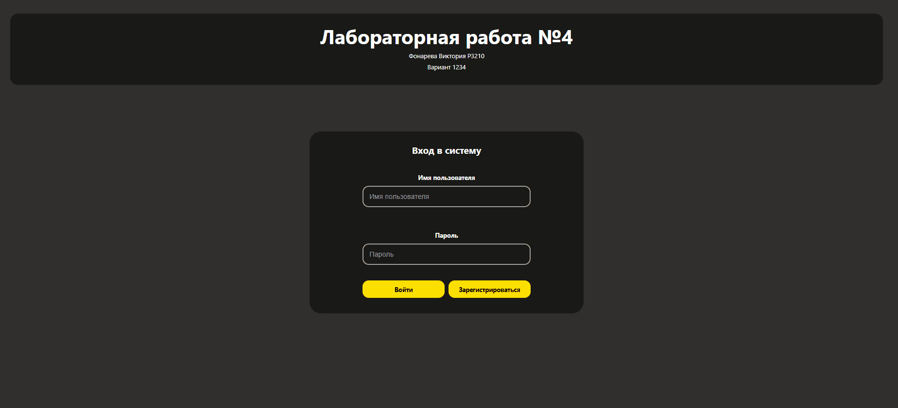

# 📐 Coordinates Web Application


Интерактивное веб-приложение для проверки попадания координат в заданную геометрическую область на плоскости. Полноценный Full-Stack проект с аутентификацией, визуализацией данных и управлением состоянием.

## 📸 Демо



## ✨ Особенности

- 🔐 **Полная система аутентификации** с JWT токенами и хешированием паролей
- 📊 **Интерактивная графическая визуализация** с возможностью добавления точек кликом
- 🎯 **Математический алгоритм** проверки попадания в составную геометрическую фигуру
- 📱 **Адаптивный дизайн** для мобильных устройств
- 📄 **Пагинация результатов** с динамическим обновлением
- ⚡ **Real-time обновления** графика при изменении параметров
- 🐳 **Docker-контейнеризация** для простого развертывания

## 🛠️ Технологический стек

### Backend
- **Java 17** + **Spring Boot 3.4.10**
- **Spring Security** с JWT аутентификацией
- **Spring Data JPA** + Hibernate
- **PostgreSQL** для хранения данных
- **Gradle** для сборки проекта

### Frontend
- **React 18.3.1** с TypeScript
- **Redux** + **Redux Thunk** для управления состоянием
- **React Router** для навигации
- **Vite** в качестве сборщика
- **CSS Modules** для изоляции стилей
- **SVG** для интерактивной графики


## 🚀 Быстрый старт

### ⚙️ Настройка конфигурации

**Создайте файл `.env` перед запуском:**

```bash
# Скопируйте примеры конфигурации
cp env.example .env
# Отредактируйте файлы при необходимости
```

### Запуск с Docker Compose

```bash
# Клонируйте репозиторий
git clone https://github.com/BrightGir/coordinates-web-app.git
cd coordinates-web-app

# Настройте .env файлы (см. выше)
# Соберите jar файл
./gradlew bootJar

# Соберите и запустите все сервисы
docker-compose up --build

# Приложение будет доступно по адресу:
# Frontend: http://localhost:5173
# Backend API: http://localhost:1260
```

## 📋 Функциональность

### Аутентификация
- Регистрация новых пользователей с валидацией:
  - Имя: 4-15 символов
  - Пароль: 6-30 символов
- Вход в систему с выдачей JWT токена
- Автоматическая проверка токена при загрузке

### Работа с координатами
- **Добавление точек двумя способами:**
  1. Через форму с выбором значений
  2. Кликом по интерактивному графику
- **Валидация параметров:**
  - X: от -2 до 2
  - Y: от -5 до 5
  - R: положительное значение (0 до 2)
- Автоматический расчет попадания в область
- Сохранение времени проверки и таймзоны клиента

### Визуализация
- **SVG график** с координатными осями и метками
- Динамическая отрисовка трех геометрических фигур:
  - Прямоугольник (I квадрант)
  - Четверть круга (III квадрант)
  - Треугольник (IV квадрант)
- Цветовая индикация результатов:
  - 🟢 Зеленый — попадание
  - 🔴 Красный — промах
- Автоматическое масштабирование при изменении радиуса

### Управление данными
- Просмотр истории всех проверок
- Пагинация (10 результатов на странице)
- Удаление результатов с автообновлением таблицы
- Сортировка по времени (новые сверху)


### API Endpoints

#### Аутентификация (публичные)
```
POST /api/auth/register  - Регистрация пользователя
POST /api/auth/login     - Вход (возвращает JWT)
GET  /api/auth/check     - Проверка токена
```

#### Работа с данными (требуют JWT)
```
POST   /api/add                        - Добавить точку
GET    /api/results?page=X&pageSize=Y  - Получить результаты
DELETE /api/delete/{id}                - Удалить результат
```
## 🔐 Безопасность

- **JWT токены** с временем жизни 24 часа
- **Stateless архитектура** без серверных сессий
- **CORS политика** настроена для конкретных origin
- **Валидация данных** на обеих сторонах (frontend + backend)
- **Spring Security фильтры** для защиты эндпоинтов
- **Проверка прав доступа** — пользователи видят только свои результаты

## 🎨 UI/UX особенности

- **Темная тема** с контрастными элементами
- **Плавные анимации** для модальных окон и переходов
- **Адаптивная верстка** с медиа-запросами для мобильных устройств
- **Интуитивный интерфейс** с визуальной обратной связью
- **Loading индикаторы** при асинхронных операциях
- **Валидация в реальном времени** с понятными сообщениями об ошибках

## 🧪 Сборка для production

### Backend
```bash
cd backend
./gradlew bootJar
# JAR файл будет в build/libs/
```

### Frontend
```bash
cd frontend
npm run build
# Собранные файлы в dist/
```

## 📝 Лицензия

MIT License - см. файл [LICENSE](LICENSE)
